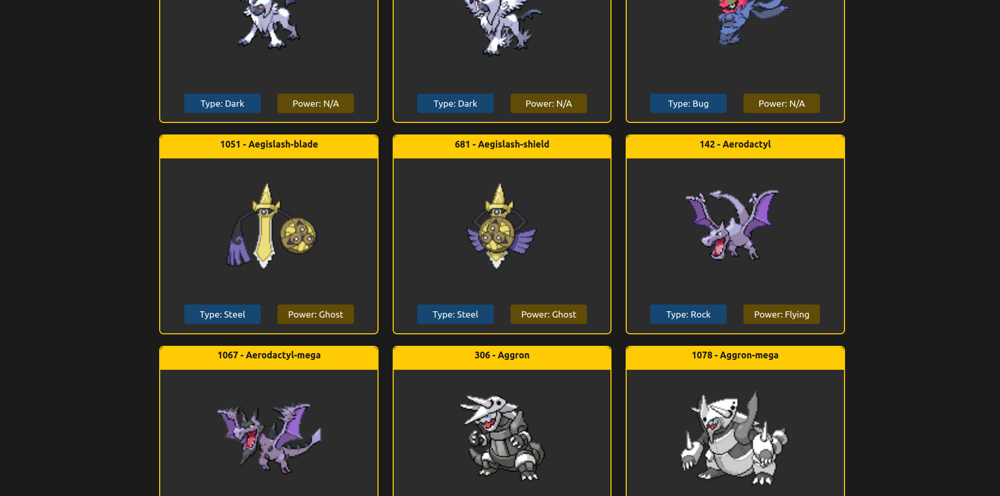
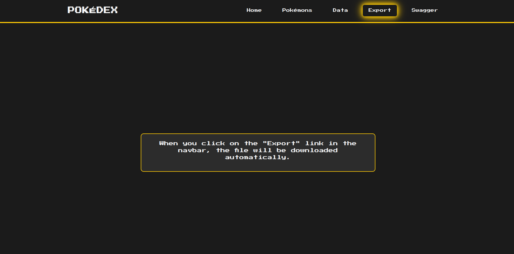

_(Versão em Português-BR | [Click here for English version](https://github.com/barbaracalderon/pokedex-api/blob/main/README.md))_

# Pokédex API e Frontend

Este projeto consiste em construir uma API Pokédex e uma interface frontend simples para interagir com ela. A API Pokédex foi desenvolvida usando FastAPI em Python, e o frontend foi construído usando Angular.

Os principais objetivos do projeto Pokédex são os seguintes:
- Criar uma API para gerenciar uma lista de Pokémon capturados com paginação e visualizações detalhadas.
- Desenvolver uma interface frontend amigável para navegar e acessar informações sobre os Pokémon.
- Implementar recursos adicionais, como exportação de dados de Pokémon e geração de documentação.
- Uso de **Gitflow** para o desenvolvimento.
- Testes unitários com Pytest.
- Docker e Docker-Compose para build e deploy.

## Autora
Barbara Calderon, desenvolvedora de software.

- [Github](https://www.github.com/barbaracalderon)
- [LinkedIn](https://www.linkedin.com/in/barbaracalderondev)
- [Twitter](https://www.x.com/bederoni)

## Índice
- [Visão Geral](#visão-geral)
- [Requisitos da API](#requisitos-da-api)
- [Executar Localmente](#executar-localmente)

## Visão Geral
O principal objetivo deste projeto é criar uma API Pokédex que gerencie uma lista de Pokémon capturados com paginação e uma interface frontend simples para visualizar a lista de Pokémon e seus detalhes.

Abaixo, algumas imagens.

## Requisitos

### API
1. **URL Base**: Recuperar dados de `https://pokeapi.co/api/v2/pokemon`.
2. **Paginação**: Implementar paginação com o comportamento padrão listando todos os Pokémon se nenhum offset ou limite for especificado.
3. **Visualização Detalhada**: Implementar uma página detalhada para cada Pokémon semelhante a `https://www.pokemon.com/us/pokedex`.
4. **Busca de Dados**:
   - Usar `httpx` para busca de dados.
   - Garantir que os dados buscados sejam suficientes para replicar os detalhes encontrados em `https://www.pokemon.com/us/pokedex`.
5. **Ordenação**: Ordenar os resultados da API alfabeticamente pelo nome do Pokémon.
6. **Funcionalidade de Exportação**: Capacidade de exportar a lista ordenada de Pokémon para um arquivo XML.
7. **Documentação**:
   - Fornecer documentação da API usando Swagger.
   - Seguir as melhores práticas no desenvolvimento da API.

### Requisitos do Frontend
1. **Tecnologias**: Usar Angular.
2. **Funcionalidades**: A interface deve permitir visualizar a lista de Pokémon e os detalhes de cada Pokémon individual.

## Executar Localmente

Clone este repositório: `git clone git@github.com:barbaracalderon/pokedex-api.git`

### Usando Docker e Docker Compose

Para executar a aplicação usando Docker e Docker Compose, siga estas etapas:

1. Certifique-se de que o Docker e o Docker Compose estão instalados em seu sistema.
2. Navegue até o diretório do projeto: `cd pokedex-api`
3. Execute a aplicação: `docker-compose up`

Isso irá construir e iniciar os serviços de backend e frontend.

#### Acessando os Serviços

- **Frontend**: O frontend Angular estará acessível em `http://localhost:4200`. Você pode abrir seu navegador e navegar para este URL para usar a interface frontend.

- **API Backend**: O backend FastAPI estará acessível em `http://localhost:8000`. Você pode acessar a documentação da API (Swagger UI) em `http://localhost:8000/docs`.

### Endpoints da API
| Método | Endpoint          | Descrição                                    |
|--------|-------------------|----------------------------------------------|
| GET    | /pokemons         | Lista Pokémon                                |
| GET    | /data             | Lista dados de Pokémon                       |
| GET    | /docs             | Documentação Swagger do OpenAPI              |
| GET    | /export           | Exporta a lista de Pokémon em formato XML    |

## Outros

### Frontend

Este projeto foi gerado com [Angular CLI](https://github.com/angular/angular-cli) versão 17.3.7.

### Servidor de Desenvolvimento

Execute `ng serve` para um servidor de desenvolvimento. Navegue até `http://localhost:4200/`. A aplicação será recarregada automaticamente se você alterar qualquer um dos arquivos de origem.

### Criação de Código

Execute `ng generate component nome-componente` para gerar um novo componente. Você também pode usar `ng generate directive|pipe|service|class|guard|interface|enum|module`.

### Construir

Execute `ng build` para construir o projeto. Os artefatos de construção serão armazenados no diretório `dist/`.

### Executando Testes Unitários

Execute `ng test` para executar os testes unitários via [Karma](https://karma-runner.github.io).

### Executando Testes de Extremidade a Extremidade

Execute `ng e2e` para executar os testes de extremidade a extremidade via uma plataforma de sua escolha. Para usar este comando, você precisa primeiro adicionar um pacote que implemente capacidades de teste de extremidade a extremidade.

### Mais Ajuda

Para obter mais ajuda sobre o Angular CLI, use `ng help` ou consulte a [Visão Geral e Referência de Comandos do Angular CLI](https://angular.io/cli).

## Considerações Finais
O projeto Pokédex representa a culminação de esforços para criar um sistema de gerenciamento de Pokémon abrangente e amigável. Desenvolvido por mim, Barbara Calderon, o projeto visa simplificar o processo de gerenciamento e acesso a dados de Pokémon, proporcionando uma experiência de usuário perfeita.

Esperamos que este sistema atenda às suas necessidades e melhore suas atividades relacionadas a Pokémon.
