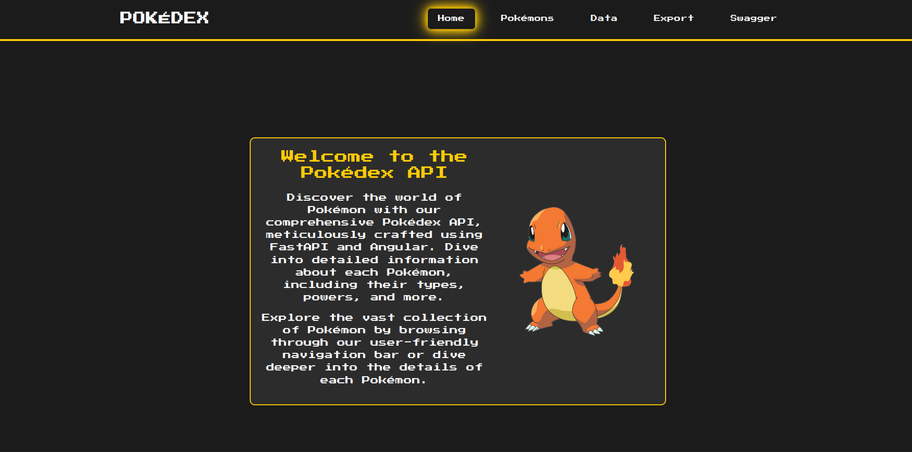
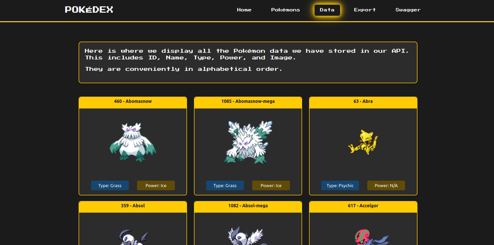

# Pokédex API and Frontend

This project consists of building a Pokédex API and a simple frontend interface to interact with it. The Pokédex API is developed using FastAPI in Python, and the frontend is built using Angular.

The primary objectives of the Pokédex project are as follows:
- To create an API for managing a list of captured Pokémon with pagination and detailed views.
- To develop a user-friendly frontend interface for browsing and accessing Pokémon information.
- To implement additional features such as exporting Pokémon data and documentation generation.

## Author
Barbara Calderon, software developer.

- [Github](https://www.github.com/barbaracalderon)
- [LinkedIn](https://www.linkedin.com/in/barbaracalderondev)
- [Twitter](https://www.x.com/bederoni)

## Table of Contents
- [Overview](#overview)
- [API Requirements](#api-requirements)
- [Submission Guidelines](#submission-guidelines)

## Overview
The main goal of this project is to create a Pokédex API that manages a list of captured Pokémon with pagination and a simple frontend interface to view the list of Pokémon and their details.

Below, some images.

## Requirements

### API
1. **Base URL**: Retrieve data from `https://pokeapi.co/api/v2/pokemon`.
2. **Pagination**: Implement pagination with the default behavior listing all Pokémon if no offset or limit is specified.
3. **Detailed View**: Implement a detailed page for each Pokémon similar to `https://www.pokemon.com/us/pokedex`.
4. **Data Fetching**:
   - Use `httpx` for data fetching.
   - Ensure that the fetched data is sufficient to replicate the details found at `https://www.pokemon.com/us/pokedex`.
5. **Sorting**: Sort the API results alphabetically by Pokémon name.
6. **Export Functionality**: Ability to export the sorted list of Pokémon to an XML file.
7. **Documentation**:
   - Provide API documentation using Swagger.
   - Follow best practices in API development.

### Frontend Requirements
1. **Technologies**: Use Angular.
2. **Features**: The interface should allow viewing the list of Pokémon and the details of each individual Pokémon.

## Submission Guidelines

Clone this repo: `git clone git@github.com:barbaracalderon/pokedex-api.git`

### Backend

Put the backend server to work.

1. Navigate to the pokedex_api backend: `cd pokedex_api/pokedex_api`
2. Run the application: `uvicorn main:app --reload`
3. Go to swagger at endpoint `localhost:8000/docs`

The backend service is running.

### API Endpoints
| Método | Endpoint          | Descrição                                    |
|--------|-------------------|----------------------------------------------|
| GET    | /pokemons         | List pokemons                       |
| GET    | /data   | List pokemons data     |
| GET    | /docs             | Swagger documentation from OpenAPI          |
| GET    | /export           | Export the list of Pokemons in xml format|

### Frontend

Put the frontend server to work.

1. Navigate to the frontend: `cd pokedex_api/frontend`
2. Run the application: `ng serve`
3. Go to the page `localhost:4200/`

The frontend service is running. 

## Others

### Frontend

This project was generated with [Angular CLI](https://github.com/angular/angular-cli) version 17.3.7.

### Development server

Run `ng serve` for a dev server. Navigate to `http://localhost:4200/`. The application will automatically reload if you change any of the source files.

### Code scaffolding

Run `ng generate component component-name` to generate a new component. You can also use `ng generate directive|pipe|service|class|guard|interface|enum|module`.

### Build

Run `ng build` to build the project. The build artifacts will be stored in the `dist/` directory.

### Running unit tests

Run `ng test` to execute the unit tests via [Karma](https://karma-runner.github.io).

### Running end-to-end tests

Run `ng e2e` to execute the end-to-end tests via a platform of your choice. To use this command, you need to first add a package that implements end-to-end testing capabilities.

### Further help

To get more help on the Angular CLI use `ng help` or go check out the [Angular CLI Overview and Command Reference](https://angular.io/cli) page.

## Final Thoughts
The Pokédex project represents a culmination of efforts to create a comprehensive and user-friendly Pokémon management system. Developed by myself, Barbara Calderon, the project aims to simplify the process of managing and accessing Pokémon data while providing a seamless user experience. We hope that this system meets your needs and enhances your Pokémon-related activities.
